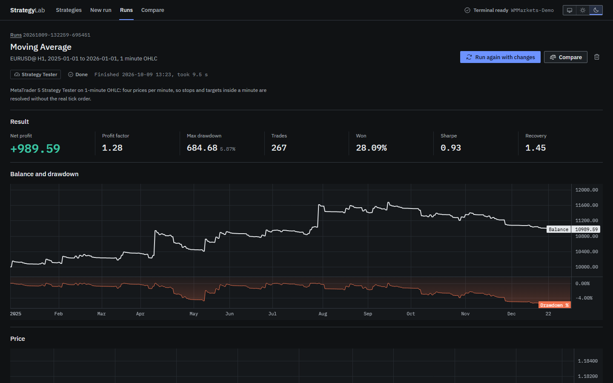
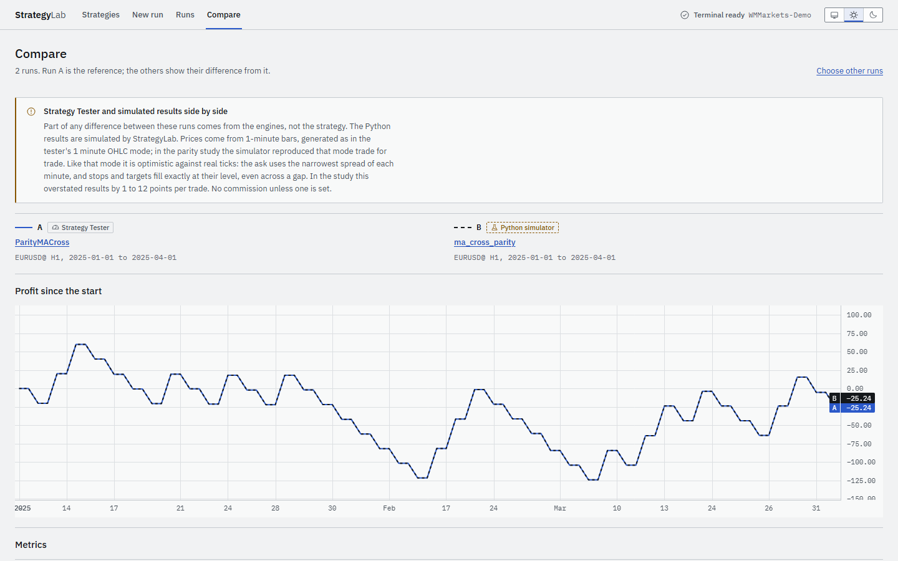
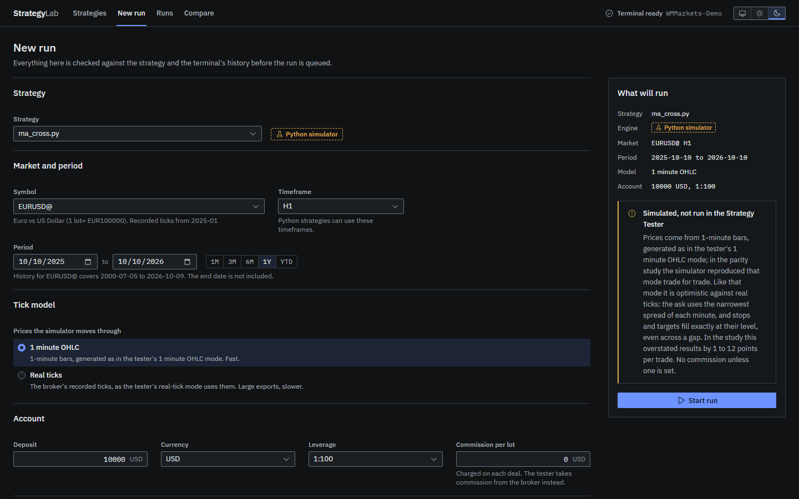

# StrategyLab

StrategyLab is a local workbench for backtesting MetaTrader 5 strategies. You give it an MQL5
Expert Advisor or a Python trading script, pick a symbol, timeframe and date range, and get back
a balance curve, a trade list, metrics, and side-by-side comparison of runs, all computed from
MetaTrader's own historical data. It runs on your machine, answers only on 127.0.0.1, and never
sends an order anywhere.



## Two engines

A strategy runs in one of two engines, and every result says which one produced it.

- **MQL5 strategies run in MetaTrader's real Strategy Tester.** StrategyLab compiles the source
  with MetaEditor, starts a dedicated terminal with a generated tester configuration, waits for
  the report, parses it and closes the terminal. The figures are MetaTrader's own, and its HTML
  report is kept beside them.
- **Python strategies run in StrategyLab's simulator.** A script written against the
  `MetaTrader5` package cannot run inside the Strategy Tester, so it runs unmodified in a
  separate process where `import MetaTrader5` gives it a stand-in: market data comes from
  history exported from the same terminal, cut at the simulated present, and orders fill in a
  simulated account. These results are an approximation and are labelled as one, before the run
  and on every screen that shows them.

| Engine | Price model | How close to the real thing |
|---|---|---|
| Strategy Tester | Every tick based on real ticks | MetaTrader's best: the broker's recorded ticks |
| Strategy Tester | Every tick | Real bar extremes, generated path and spread between them |
| Strategy Tester | 1 minute OHLC | Four prices per minute; stops and targets inside a minute resolved without the real tick order |
| Strategy Tester | Open prices only | Valid only for strategies that act once per bar and use no intrabar stops |
| Python simulator | 1-minute bars | Reproduced the tester's 1 minute OHLC mode trade for trade in the parity study (394 of 394 trades). Like that mode, optimistic against real ticks by 1 to 12 points per trade |
| Python simulator | Recorded ticks | Fills stops and targets at the crossing tick, as the tester does. A script that polls acts when it wakes, which can be later than an EA reacting to the first tick of a bar |

The numbers come from [the parity study](reports/parity.md): one strategy written twice, in
MQL5 and in Python (`samples/parity/`), run through both engines on EURUSD and USDJPY, H1 and
M15. Compare puts any runs side by side, whichever engine produced them:



## Setup

These steps start from a clean Windows 10 or 11 machine.

### 1. Tools

Install, accepting the defaults:

- [Git for Windows](https://git-scm.com/download/win)
- [Python 3.11 or newer](https://www.python.org/downloads/windows/), 64-bit. If `python` on your
  PATH is older, setup finds 3.11 through the `py` launcher, or through
  [uv](https://docs.astral.sh/uv/) if it is installed.
- [Node.js 20 or newer](https://nodejs.org/) (the LTS installer)

### 2. A MetaTrader 5 terminal for backtesting

StrategyLab starts and stops its terminal by itself, and only one running terminal can use a
data folder, so it gets a copy of MetaTrader 5 of its own. Your everyday terminal stays
untouched and can stay open.

1. Install MetaTrader 5 from your broker, or from metatrader5.com, if you have not already.
2. Copy the whole install folder (for example `C:\Program Files\MetaTrader 5`) to
   `C:\MT5-Lab`.
3. Start the copy in portable mode, so its data lives inside `C:\MT5-Lab`. In a command prompt:

   ```
   C:\MT5-Lab\terminal64.exe /portable
   ```

4. Log in to a **demo** account (File, Open an Account, if you need a new one), and tick the
   option to save the login details so the terminal reconnects on its own. StrategyLab never
   needs a live account, and you should not give it one. It never asks for your credentials
   either: the terminal remembers them.
5. Open a EURUSD chart once so the terminal downloads history for it, then close the terminal.

### 3. StrategyLab

In Git Bash or a command prompt:

```
git clone https://github.com/HajibagheriLabs/MT5-Strategy-Lab.git
cd MT5-Strategy-Lab
python tasks.py setup
```

`setup` creates `.venv`, installs the backend into it and the frontend's packages with npm.

Copy `local.toml.example` to `local.toml` and edit two lines: `path` under `[terminal]`, the
folder from step 2 (`'C:\MT5-Lab'`), and `server` under `[account]`, the trade server shown in
the terminal's login dialog (for example `'Broker-Demo'`). `local.toml` describes your machine,
so git ignores it. Without it StrategyLab tries to find a terminal by itself and says what it
found.

Check that everything was found and that MetaEditor compiles:

```
python tasks.py doctor
```

It lists the terminal, its data folder and the account server, then compiles MetaTrader's
"Moving Average" example and reports `OK, 0 errors, 0 warnings`. Its `running` line should say
`no`: StrategyLab cannot start runs while that terminal is open.

### 4. Start

```
python tasks.py start
```

This builds the frontend when it has changed, serves the app at http://127.0.0.1:8000 and
opens it in your browser. Daily use is this one command. Ctrl+C stops it.

## Usage

**Your first backtest.**

1. **Strategies**: drop `C:\MT5-Lab\MQL5\Experts\Examples\Moving Average\Moving Average.mq5` on
   the page. It is compiled at once; errors are listed with their file and line, and its inputs
   become a form.
2. **New run**: choose the strategy, `EURUSD` (with your broker's suffix, if it uses one), `H1`,
   a period such as 2025-01-01 to 2026-01-01 (the end date is excluded, as in the tester) and a
   tick model. Change any inputs, then start the run.
3. The run page follows it live: queued, compiling, running in the tester, parsing, with the
   terminal's journal as it is written. A year of H1 on 1-minute OHLC takes about ten seconds
   once history is downloaded. The first run on a symbol downloads its history and takes
   longer.
4. The result: headline figures, balance with drawdown, a price chart with every entry and exit,
   the deals table (choose a deal to move the chart to it), all metrics beside MetaTrader's own
   names for them, the logs and MetaTrader's original report.

**What can be uploaded.** MQL5 source (`.mq5`); a compiled expert (`.ex5`), with a `.set` file
saved from the Strategy Tester if you want to choose its inputs; a `.zip` of an expert and its
include files; or a Python script (`.py`). Inputs of a Python script are its module-level
constants in capitals (`FAST_PERIOD = 12`) and its argparse options, and the runs change them
without touching the file. `samples/python/ma_cross.py` is an example written the ordinary way:
a polling loop that never returns.



**Runs** lists every run, newest first, filterable by engine, status and text. Choose two to
four finished runs to compare them, or open one and run it again with changes. A run can be
cancelled while it is queued or running; the tester is closed and nothing is left behind.

**Where things are kept.** Runs, logs, the run history and history caches are in `workspace\`
in the repository; delete it to start over. In the terminal's folder StrategyLab writes only
uploaded experts, under `MQL5\Experts\StrategyLab\`, and moves each tester report out of
`StrategyLab\reports\` once a run ends.

## Development

```
python tasks.py dev       backend and frontend dev servers with reload, http://127.0.0.1:5173
python tasks.py lint      ruff, eslint and the TypeScript compiler
python tasks.py test      unit tests; tests that need the terminal run when local.toml exists
python tasks.py e2e       browser tests against a fake API
```

The browser tests need Playwright's Chromium once: `cd frontend` then
`npx playwright install chromium`. `DECISIONS.md` records what StrategyLab relies on about
MetaTrader 5 and how each point was checked; `frontend/DESIGN.md` is the design system.

## Limitations

- **Windows only**, since MetaTrader 5 is.
- **Python results are simulated, and approximate.** The parity study
  ([reports/parity.md](reports/parity.md)) ran one strategy, written once in MQL5 and once in
  Python, through both engines on EURUSD and USDJPY, H1 and M15, over three months. On
  1-minute bars the simulator reproduced the tester's "1 minute OHLC" mode exactly: 394 of 394
  trades identical to the cent. Both, however, were optimistic against the tester's real-tick
  mode, by 1 to 12 points per trade. 1-minute bars carry only the narrowest spread of each
  minute, and they fill stops and targets at their level even across a gap. On recorded ticks
  the simulator fills as the tester does. The study covers one kind of strategy (market
  entries with fixed stops, one position at a time), with no pending orders and no commission.
- **The simulator supports a subset of the `MetaTrader5` package**: `initialize`, `login`,
  `shutdown`, `version`, `last_error`, `account_info`, `terminal_info`, `symbols_total`,
  `symbols_get`, `symbol_info`, `symbol_info_tick`, `symbol_select`, `copy_rates_from`,
  `copy_rates_from_pos`, `copy_rates_range`, `copy_ticks_from`, `copy_ticks_range`,
  `order_calc_margin`, `order_calc_profit`, `order_check`, `order_send`, `positions_total`,
  `positions_get`, `orders_total`, `orders_get`, `history_orders_total`, `history_orders_get`,
  `history_deals_total` and `history_deals_get`, with every constant of the package. Anything
  else (the market book, for one) raises an error naming it. Market, limit and stop orders are
  simulated; stop-limit orders and close-by are not, and neither is stop-out. Python strategies
  run on M1, M5, M15, M30, H1, H4 and D1.
- **One symbol per Python strategy.** A Python strategy is simulated on the run's symbol only;
  asking for another raises an error. MQL5 strategies run in the tester, which handles
  multi-symbol experts itself, though StrategyLab charts only the run's symbol.
- **Not supported yet**: optimisation, forward and walk-forward testing, and batch runs across
  symbols. Commission comes from the broker in the tester and is a fixed amount per lot in the
  simulator, zero unless set.
- **A backtest is not a prediction of live results.** Slippage, requotes, partial fills, latency
  and changing spreads in live trading are absent or simplified in both engines, and a strategy
  tuned on past data usually does worse on the data that follows.

## Licence

MIT, see [LICENSE](LICENSE).
